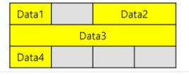

# Start
## 복잡도 분석
- 입력 크기에 대한 함수
- 단순한 함수로 표현하기 위해 ```점근적 표기``` 사용
- O(빅 오)표기, Ω(빅 오메가)표기, θ(빅 세타)표기

### O(빅 오)표기
- 점근적 상한 표기
- 복잡도가 f(n) = 2n^2 - 7n + 4 이면
<br> f(n) = O(N^2)
  
- 실행시간이 n^2에 비례하는 알고리즘
- 최대한 걸리는 시간

### Ω(빅 오메가) 표기
- 점근적 하한 표기
- O와 표기는 마찬가지
- 최소한 걸리는 시간을 의미

### θ(빅 세타) 표기
- O표기와 Ω표기가 같은 경우 사용
- 상한선과 하한선의 사이를 기준으로 표기

<br>
<br>

---
## 비트 연산자
- ```&```: and 연산
- ```|```: OR 연산
- ```^```: XOR 연산 (같으면 0, 다르면 1)
- ```~```: 피연산자의 모든 비트 반전
- ```<<```: 피연산자의 비트열을 왼쪽으로 이동
- ```>>```: 피연산자의 비트열을 오른쪽으로 이동

### 1 << n
- 2^n의 값을 가짐
- 원소 n의 모든 부분집합 수

### i & (1 << j)
- i의 j번째 비트가 1인지 아닌지 확인

<br>
<br>

---

## 엔디안
- 1차원 공간에 여러 개의 연속된 대상을 배열하는 방법
- HW 아키텍처마다 다름
- 바이트 단위와 워드 단위를 환산할 떄 이해하지 못하면 오류 발생

## 빅 엔디안
- 큰 단위가 앞에 옴
- 네트워크


## 리틀 엔디안
- 작은 단위가 앞에 옴
- 데스크탑 컴퓨터

<br>

|종류|0x1234|0x12345678|
|:---:|:---:|:---:|
|빅 엔디안|12 34|12 34 56 78|
|리틀 엔디안|34 12|78 56 34 12|

<br>
<br>

---
## 비트 연산
### Byte Alignment
- 32 bit machine에서 32 bit bus line을 활용하여 메모리 access
- 프로세서의 성능 향상을 위해 4배수 형태 주소만 access
- 4배수형 주소가 있지 않다면 메모리 access를 2번 해야 함
    + 1 byte: 어떠한 주소번지에라도 기록
    + 2 byte: 2 byte boundary 정렬
    + 4 byte: 4 byte boundary 정렬
    + Double형은 window에서는 8 byte, 리눅스에서는 4byte boundary에 저장

### Structure Byte Padding
- 구조체 멤버들이 bytr alignment을 해야하는 관계로 멤버들 사이에 임의의 공간이 생기는 현상
- 구조체의 경우, 멤버 중 가장 큰 데이터 타입의 배수 값으로 크기 결정

```java
// size = 3 * 4 = 12
class Message{
	char Data1;
	short Data2;
	int Data3;
	char Data4;
}
```



```java
// size = 2 * 4 = 8
class Message{
	char Data1;
	char Data4;
	short Data2;
	int Data3;
}
```

<br>
<br>

---

## 진수
### 음의정수 표현법
- 1의 보수: 부호비트를 제외한 나머지 비트들을 ```1 -> 0, 0 -> 1```로 변환
- 2의 보수: 1의 보수 + 1

## 실수
### 실수 표현
- 부동소수점 표기법 사용
- 소수점의 위치를 고정시켜 표현하는 법
- 소수점 위치를 왼쪽의 가장 유효한 숫자 다음으로 고정시키고 밑수의 지수승으로 표현
> 1001.0011 -> 1.0010011 * 2^3

### 실수 저장 방식
1. 단정도 실수 (32비트)
    + 부호(1비트) + 지수(8비트) + 가수(23비트)
2. 배정도 실수 (64비트)
    + 부호(1비트) + 지수(11비트) + 가수(52비트)
    
- 가수부 = 실수의 유효자릿수들을 부호화된 고정 소수점으로 표현한 것
- 지수부 = 실제 소수점 위치를 지수 승으로 표현한 것