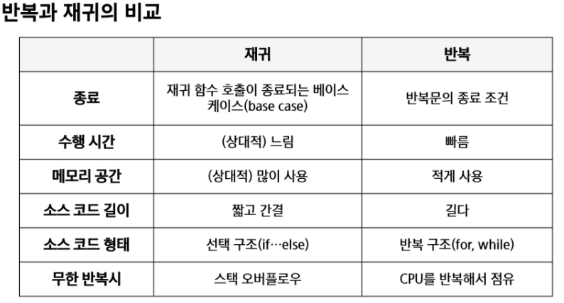
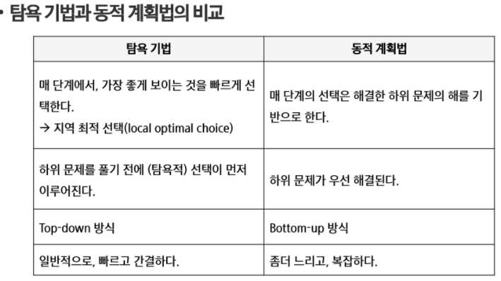

# 재귀
> 주어진 문제의 해를 구하기 위해 동일하면서 더 작은 문제의 해를 이용하는 법
> <br> 입력값 n이 커질수록 비효율적일 수 있음

## 재귀적 정의
1. 하나 or 그 이상의 기본 경우
   - 집합에 포함되어 있는 원소로 induction 생성을 위한 시드 역할
2. 하나 or 그 이상의 유도된 경우
    - 새로운 집합의 원소를 생성하기 위해 결합되는 방법
    
## 재귀 함수
- 함수 내부에서 자기 자신을 호출하는 함수
- 기본 부분, 유도 부분 구성
- 간결하고 이해하기 쉬움
- 함수 호출은 스택 사용
    - 반복적 스택 사용을 의미 
      <br>```메모리 속도에서 성능저하 발생```
    
      
### 재귀적 선택정렬
```java
class SelectionSort {
	void Recur_SelectionSort(int[] a, int depth, int n) {
		int min = depth;

		if (depth == n)
			return;

		for (int i = depth + 1; i < n; i++) {
			if (a[depth] > a[i])
				min = i;
		}

		int tmp = a[depth];
		a[depth] = a[min];
		a[min] = tmp;

		Recur_SelectionSort(a, depth + 1, n);

	}
}
```

<br>
<br>

---

# 완탐
## 브루트포스
- 대부분 문제에 적용 가능
- 자료의 크기가 작다면 유용
- 알고리즘 효율성 판단을 위한 척도로 사용
- 완탐으로 접근하여 해답 도출 후, 성능 개선을 위해 다른 알고리즘 사용하고 확인하는 것이 바람직

### 장점
- 해답을 찾을 확률 높음
- 그리디나 DP를 이용해 효율적 알고리즘 찾을 수 있음

### 단점
- 수행 속도가 느림

<br>
<br>

---
# 조합
## 순열
> 서로 다른 몇 개를 뽑아서 한줄로 나열한 것
> - nPr = n * (n - 1) * ... * (n - r + 1)
> - nPn = n * (n - 1) * ... * 2 * 1
- n > 12일 경우, 시간 복잡도 폭발적으로 UP

```java
class Perm {

	int[] arr;

	// n:원소 개수, i: 선택된 원소 개수
	public void perm(int k) {
		if (n == k) {
			return;
		}

		for (int i = k; i < n; i++) {
			swap(k, i);
			perm(k + 1);
			swap(k, i);
		}
	}
}
```
## 조합
```java
class Comb {

	void comb(int n, int r) {
		int[] tr;   // r개 크기의 배열, 조합 임시 저장
		int[] arr;  // n개의 원소를 가지고 있는 배열
		if (r == 0) {
			print_array();
			return;
		} else if (n < r)
			return;
		else {
			tr[r - 1] = arr[n - 1];
			comb(n - 1, r - 1);
			comb(n - 1, r);
		}
	}
}
```

## 부분집합
```java
class PowerSet {

	void powerSet() {
		int[] arr;
		int n = arr.length;

		for (int i = 0; i < (1 << n); i++) {
			for (int j = 0; j < n; j++) {
				if (i & (i << j))
					print(arr[j]);
			}
			println();
		}
	}
}
```

## 중복조합
```java
class H {

	void H(int n, int r) {
		if (r == 0)
			print_arr();
		else if (n == 0)
			return;
		else {
			t[r - 1] = arr[n - 1];
			H(n, r - 1);
			H(n - 1, r);
		}
	}
}
```

<br>
<br>

---
# 탐욕
> - 선택 시점에서 이뤄지는 결정은 지역적으로 최적이지만 전체적으로 최적이라는 보장이 없음
> - 제한적인 문제들에 적용

## 배낭 짐싸기
- 도둑이 훔친 물건을 배낭에 담아올 계획
- 담을 수 있는 물건의 총 무게 = W
- 배낭이 수용할 수 있는 무게를 초과하지 않으면서 값이 최대가 되는 경우를 구하는 문제

### 무게 분할 불가의 경우
```java
class KnapSack_not_divide {

	int n, k;           // 전체 개수 = n, 가지고 나올 수 있는 무게 = k
	int[][] item = new int[n][2];   // [n][0]에는 무게를, [n][1]에는 가격을 저장
	int max = 0;

	void dfs(int depth, int weight, int val) {
		if (depth == n) {
			max = Math.max(max, val);
			return;
		}

		// 물건을 포함할 수 있는 경우 포함후 재귀
		if (weight + item[depth][0] <= k) {
			dfs(depth + 1, weight + item[depth][0], val + item[depth][1]);
		}

		// 물건을 포함하지 않고 재귀
		if (weight <= k) {
			dfs(depth + 1, weight, val);
		}
	}
}
```

### 무게 분할 가능의 경우
```java
class KnapSack {

	void main() {
		int[][] item;
		int limit;

		Arrays.sort(item, new Comparator<Integer>() {
			@Override
			public int compare(int[] o1, int[] o2) {
				int prev = o1[0] / o1[1];
				int cur = o2[0] / o2[1];

				if (cur - prev > 0)
					return 1;
				else
					return -1;
			}
		});

		int result = 0;

		for (int i = 0; i < item.length; i++) {
			int[] cur = item[i];
			if (limit > 0) {
				if (limit >= cur[1]) {
					limit -= cur[1];
					result += cur[0];
				} else {
					result += (cur[0] / cur[1] * limit);
					limit = 0;
				}
			} else {
				break;
			}
		}
		System.out.println(result);
	}
}
```

## 활동 선택 문제
```java
class Recursive_Selection {
	// A = 정렬된 활동 집합
	// S = 선택된 활동 집합
	// si: 시작시간, fi: 종료시간

	public static void main(String[] args) {
		// num, start, end
		Integer[][] activity = new int[n][2];

		Arrays.sort(activity, new Comparator<int[]>() {
			@Override
			public int compare(int[] o1, int[] o2) {
				if (((Comparable) o1[2]).compareTo(o2[2]) > 0)
					return 1;
				else
					return -1;
			}
		});

		int last = 0;
		List<int[]> result = new ArrayList<>();

		for (int i = 0; i < activity.length; i++) {
			int[] a = activity[i];
			if (last < a[1]) {
				last = a[2];
				result.add(a);
			}
		}

		for (int[] a : result) {
			System.out.println(a[0]);
		}
	}
}
```

