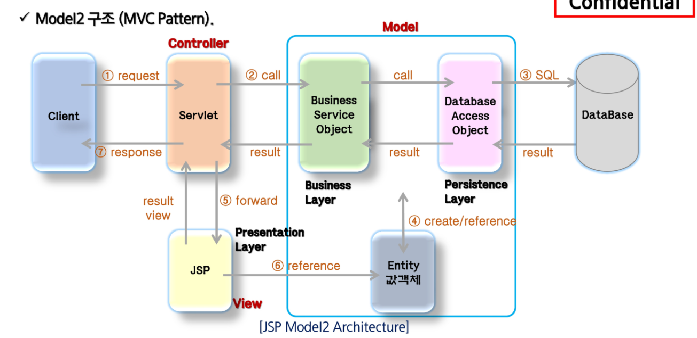

# Web Architecture
1. Client(Web Browser)에서 데이터 요청
2. Web Server에 Client 접속
3. 정적 리소스 처리
    + HTML, CSS, 요청되는 문서...
    + 요청되는 문서는 /를 기준으로 가지고 온다
4. Application Server가 클라이언트 요청에 대한 Logic처리
    + Presentation
    + Business Logic
    + Persistence Logic → DB와 연결
5. 처리한 응답을 클라이언트에 전달
6. 헤더 정보를 토대로 데이터가 뿌려짐

- Web Server + Application Server = WAS
- WAS + RDBMS = Server

<BR>
<BR>

---
# Network
- ```network```: 서버와 클라이언트 간의 데이터 교환 행위
- ```IP``` 주소: 네트워크 상에서 각각의 컴퓨터를 구별하기 위한 고유 번호
  + 나 자신: 127.0.0.1  →  해당 IP로는 외부에서 접속 불가
    
- ```포트```: 서버에서 제공하는 특별한 서비스를 위한 작업단위의 고유번호
    + http: 80
    + https: 443
    + sftp: 22
    + smtp: 25
    + MySQL: 3306 ...
    
- 프로토콜: 서버와 클라이언트간의 통신 규약

<br>

---

# ※ 통신 방법
## 1. TCP/IP
- TCP: 연결지향 프로토콜
    + IP가 처리할 수 있도록 메시지를 패킷으로 나누고 반대편에 패킷을 재조립하여 메시지를 만듦
    + 패킷마다 번호 제공
    + 재조립 시, 번호로 재조립함
    
- IP: 실제 데이터 배달 처리
- ex) 채팅 프로그램

### TCP/IP 4계층
1. 응용 계층
2. 전송 계층 (TCP & UDP)
3. 인터넷 계층 (IP)
4. 물리 계층

## 2. UDP
- TCP와 달리 메시지를 패킷으로 나누고 재조립하는 서비스 X
- 도착하는 데이터 패킷 순서 제공 X
- 들어오는 대로 바로 처리 -> 순서에 상관없이 빨리 전송하기 위해 사용
- ex) 유튜브 영상, 실시간 처리...

<br>

---
## HTTP 통신 규약
### 요청
- Method: GET
- path: /
- Version of Protocol: HTTP/1.1
- Header: Host: ~
```http request
GET / HTTP/1.1
Host: developer.mozilla.org
Accept-Language: fr
```


### 응답
- Version of protocol: HTTP/1.1
- Status Code: 200
- Status Message: OK
- Headers: Date: ~

```http response
HTTP/1.1 200 OK
Date: Sat, 09 Oct 2010 14:29
Server: Apache
....
```

<br>

---

# Servlet
## Preview: 프로젝트 구조
- src: 자바 파일 위치
- Apache Tomcat ~ : 톰캣 라이브러리
- WebContent: view 폴더 (html, css, jsp, js, image...)
- web.xml: web application 설정 파일.
    + web module 3.0 이상은 annotation으로 대체

## ※ Servlet
- 자바를 사용해 웹페이지를 동적으로 생성하는 서버측 프로그램 or 그 사양
- 웹 서버 성능 향상을 위한 자바 클래스
- 자바 코드 안에 HTML 코드 포함
    + ```JSP는 HTML안에 자바 코드 포함```
    

## 라이프사이클
- main method가 없음
- 객체 생성부터 사용의 주체 = Servlet Container
- 클라이언트 요청 시, 객체 생성과 초기화는 한번만
    + 요청 처리는 요청마다 반복
    
- 제거하는 것도 Container가 포함

<br>

|method|설명|
|:---:|----|
|init()|서블릿이 메모리에 로드될 때 한번 호출<br>코드 수정 시 다시 로드, 다시 호출|
|```doGet()```|GET방식으로 data 전송시 호출|
|```doPost()```|POST방식으로 data 전송시 호출|
|```service()```|모든 요청은 service()를 통해서 doXXX()로 이동|
|destroy()|서블릿이 메모리에서 해제되면 호출|

※ ```___```은 요청마다 반복 실행
※ 나머지는 최초 요청 한번만 실행


## ※ 파라미터 전송방식
| |GET|POST|
|:---:|---|---|
|특징|전송되는 데이터 URL 뒤에 QueryString으로 전달<br> 입력값이 적거나 노출되어도 좋은 경우 사용|URL과 별도로 전송<br> HTTP 헤더 뒤 Body에 입력스트림데이터로 전달|
|장점|간단한 데이터 빠르게 전송<br> 직접 URL에 입력하여 전송 가능|데이터 제한 X <BR>최소한의 보안유지 효과 있음|
|단점|데이터 양에 제한있음<BR>(URL + 파라미터)를 통해 최대 2kb까지 전송 가능|전달 데이터 양이 같은 경우, GET보다 느림|

<br>

---
## URL
http://www.ssafy.com/good.jsp?parameter1=value1&parameter2=value2

- URL: http://www.ssafy.com/good.jsp
- QueryString Begin: ?
- Parameter Name: parameter1
- parameter Value: value1
- Query String Separator: &...

<br>

---
# JSP
- Java Server Page
- html내에서 자바 코드를 삽입하여 웹 서버에서 동적으로 웹 페이지 생성
- 자바 서블릿으로 변환된 후, 실행
- 서블릿과 달리 웹 디자인하기에 편리하다.
- html 문서부분 작성 유리 / Java 코드 작성 불리. 가독성과 유지보수성 떨어짐

## ※ 스크립팅 요소
### 1. 선언
- ```<%! 멤버 변수, 메서드 선언 %>```

### 2. 스크립트릿
- 클라이언트 요청시 호출되는 영역
- Servlet 변환 시, service()에 해당되는 영역
- request, response 관련 부분

- ```<% 자바 코드 %>```

### 3. 표현식
- 자바 데이터를 브라우저에 출력할 때 사용
- ```<%= 문자열 %>```
  
### 4. 주석
- ```<%-- JSP 주석 코드 --%>```

<br>

---
# MVC
## Web Application Architecture
- model1과 model2로 나뉨
- model1: JSP가 클라이언트 요청에 대한 로직 처리 & 응답 페이지에 대한 처리를 모두 함
- model2: 응답 페이지에 대한 처리만 함

## Model1
- View와 Logic을 JSP 페이지 하나에서 처리하는 구조
- 요청이 들어오면 JSP 페이지는 java beans나 별도의 service class를 이용하여 작업 처리

### 장점
- 구조 단순
- 직관적
- 개발 시간 단축

### 단점
- 출력을 위한 html 코드와 로칙 처리를 위한 java코드가 섞여 있음
- 분업이 힘듦 -> JSP = HTML + JAVA
- 규모가 커지면 코드가 복잡해짐 -> 유지보수성 DOWN
- 확장성이 나쁨


## Model2
- ```MVC```
- client 요청은 servlet이 // 로직 처리는 java class // 클라이언트에게 출력하는 페이지를 JSP가 처리

| model2 | mvc 패턴 | 설명 |
| --- | --- | --- |
| Service, DAO, Java Bean | Model | - Logic을 처리하는 모든 것<br>- Controller로 넘어온 data를 이용해 수행하고 결과를 Controller에 리턴 |
| JSP | View | - 화면 처리 담당<br>- 클라이언트 요청만이 아니라 Controller 요청도 jsp가 처리<br>- 결과출력을 위한 code만 존재 |
| servlet | Controller | - 클라이언트의 요청 분석 → 로직 처리를 위한 model 호출<br>- return 받은 data에 따라 request, session등에 저장 |

### 구조


1. Controller에서 클라이언트로부터 요청을 받음
2. ListBoardService에서 Execute를 실행
3. DAO에서 SQL 실행
4. SQL의 결과물이 다시 Servlet으로 가서 JSP를 통해서 Entity의 형태로 데이터가 뿌려짐
5. 뿌려진 데이터를 클라이언트가 봄

### 장점
- 코드가 분리되어 있어 복잡하지 않음
- 분업이 용이
- 기능에 따라 코드 분할 -> 유지보수 용이
- 확장성 좋음

### 단점
- 구조 복잡
- 개발시간 증가 -> 비용 증가