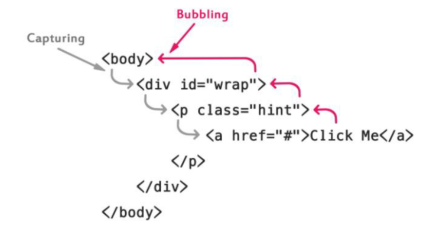

# Javascript
> - 객체지향 개념을 지원하는 스크립트 프로그래밍 언어
> - HTML 문서를 읽어들이는 시점에서 Javascript 엔진이 실행됨
>   + 인터프리터 언어
>   + 코드를 인터프리터가 바로 한줄씩 해석
>   + ECMAScript를 표준으로 지원

### 컴파일러 vs 인터프리터
|컴파일러|인터프리터|
|:---:|:---:|
|바이트 코드를 만들어서 코드 최적화 하기 편함|코드를 바로 읽어 수행하기 때문에 코드 최적화 안됨|
|초기 실행 속도 느림|초기 실행속도 빠름|
|한 번 실행되고 나면 빠름|코드에 따라 실행속도가 다름|
|Servlet|node.js|

## 특징
- 웹 브라우저에서 동작하는 프로그래밍 언어
    + HTML, CSS 중에서 유일하게 동작함
- 개발자의 컴파일 작업이 없는 인터프리터 언어
- Javascript 엔진 사용
    + 인터프리터와 컴파일러의 장점 결합 -> 속도가 느린 단점 완화
- 멀티 패러다임 프로그래밍 언어
    + 명령형, 함수형, 프로토타입 기반 객체지향 언어 지원
    

## 선언
- < script >태그 사용
- src와 type 속성 사용
    + src: 외부의 javascript 파일을 포함할 때 사용
    + type: 미디어 타입 지정할 때 사용 / html5부터 생략 가능
    
- < head > 나 < body > 내부에 선언 가능
    + < body > 맨 하단 부분에서 선언하는 것 권장
    + 각종 입출력 발생 전에 초기화하기 때문 -> 사용자가 더 빠르게 느낌
    
## 변수
- 값이 할당되지 않은 것은 undefined 처리됨
- 변수 자체가 없으면 not defined
- 변수 타입: var
    + 자동으로 변수 타입 할당됨
    
- ECMAScript 표준에 따라 Camel case 표기법 사용
    + 2개 이상의 단어로 이름 구성 시, 단어의 첫글자 = 대문자
    
- 특수문자 언더바(_)와 달러($) 허용
  

## 자료형
- 원시타입: 숫자, 문자열, boolean, null, undefined
- 객체타입: 나머지 다
- 타입 명시는 하지 않지만 기본적으로 자료형 존재
> - ※ 자동 형 변환
>   + 자료형에 대해 느슨한 규칙 적용
>   + 서로 다른 자료형 연산 가능
>   + 모든 자료형을 var로 선언하기 때문에 혼란 발생 가능성 有
>       + console.log("40" + 5)     -> 405
>       + console.log("40" - 5)     -> 35

## ※ 변수 호이스팅
- var 키워드 변수는 중복 선언 가능
- V8 엔진이 해당 Scope의 모든 변수 선언을 수집
- scope의 맨 윗줄에 옮김
- 아래에 선언된 변수도 값이 지정되지 않은 undefine으로 출력됨
- -> 변수사용 위치가 선언위치보다 높이 있어도 되는 것

## let 키워드 VS const 키워드 VS var
|키워드|구분|선언위치|재선언 가능|
|:---:|:---:|:---:|:---:|
|var|변수|전역 스코프|가능|
|let|변수|해당 스코프|불가능|
|const|상수|해당 스코프|불가능|

- let은 final이 붙은 변수
- const는 변수가 아닌 상수.

```http
<script>
	console.log(a);   // undefined
	var a = 1;
	console.log(a);   // 1
</script>

<script>
	var a = 2;
  function foo(){
	  var b = 1;
  }
  console.log(b);  // not defined
</script>

<script>
	for(var i = 1; i < 5; i++){
		console.log(i);    //1 2 3 4 
	}
	console.log(i);      //5
</script>

// ECMA 6, let, const
<script>
	console.log(a);   // not defined, V8로 변수 수집 불가
	a = 1;
	let a = 1;        // 변수이지만 재선언이 불가능, 가독성이 높아짐
	console.log(a);   // 
</script>

<script>
	console.log(a);   // not defined, V8로 변수 수집 불가
	a = 1;
	const a = 1;        // 변수이지만 재선언이 불가능, 가독성이 높아짐
	console.log(a);   // 
</script>
```

### null  vs  undefined
- null: 값이 없거나 비어있음. 초기화가 null이 되어있는 상태
- undefined: 값이 초기화가 되어있지 않음

### 연산자
- delete: 프로퍼티 제거
- typeof: 해당 변수의 타입 리턴
- instanceof: 객체가 특정 객체의 타입인지 확인
- === : 자료형까지 비교하여 같은지 확인

----

# ※ 객체
> - 이름 + 값으로 구성된 프로퍼티 집합
> - 문자열, 숫자, boolean, undefined, null 제외한 모든 값
> - 전역 객체를 제외한 객체는 프로퍼티를 동적으로 추가/삭제 가능
> - 함수도 프로퍼티 값으로 사용 가능

## 생성
1. 객체 리터럴
    - 가장 일반적
    - { }안에 프로퍼티를 추가하여 객체 생성
    

2. Object 생성자 함수
    - new와 object 생성자 함수를 호출해 빈 객체 생성
    - 생성 후에 프로퍼티, 메소드 추가
    

3. 생성자 함수
    - 클래스 아님
    - 클래스처럼 간단하게 생성 가능
    - 코드 재사용성 증가
    
## ※ 속성값 조회
- dot(.)이나 대괄호를 사용해 속성값에 접근
- 대괄호에 들어가는 프로퍼티 이름 = 문자열
- dot은 연산자가 포함된 프로퍼티 이름은 접근 불가
- || 연산자 사용
    + var middle = employee['middle_name'] || 'none';
    + -> employee에 middel_name이 없으면 none 출력
    
## 기타등등
- 속성 제거는 delete연산자 사용
- 객체는 복사 X  참조 O
- 타입확인은 typeof연산자 사용


## ※ 함수
- 선언 시, 리턴 타입 쓰지 않아도 됨
- ※ function 변수명 으로 함수 선언
- javascript에서는 일급 객체
- 다른 함수의 전달인자, 리턴 값...으로 사용 가능
- ※ 동적으로 생성 가능
- 함수 선언문, 함수 표현식, function 생성자...
```javascript
// 함수 선언문
function 함수이름(매개변수){
  //정의
}


// 함수 표현식
var 함수이름 = function (매개변수) {
  // 정의
}


// function 생성자 함수
var 함수이름 = new Function("매개변수", "매개변수", "함수내용");
```

## ※ 함수 호이스팅
- 함수 선언문의 경우, 함수 선언 위치와 관계없이 코드 내 어느 곳에서든 호출 가능
    + 사용하기 쉬움
    + application 개발의 경우, 인터프리터에 많은 변수 객체가 저장되어 응답속도가 느려질 수 있음
- 모든 선언을 호이스팅
- 자바스크립트 엔진이 스크립트를 로딩하는 시점에 변수객체 저장
- 함수 표현식의 경우, 변수 호이스팅 발생
    + 실무에서는 함수 표현식 권장
    
## 콜백 함수
- 특정 이벤트 발생시 시스템에 의해 호출되는 함수
- 비동기식 처리 모델에서 사용됨
- 처리가 종료되면 호출될 함수를 미리 매개변수에 전달하고 처리가 종료되면 호출

```javascript
var btn = document.getElementById('btn');
btn.addEventListener("click", function() {
  console.log("콜백함수 호출");
});
```

---
# Window 객체
- 웹브라우저에서 작동하는 최상위 전역객체
- BOM(Brower Object Model)로도 불림

## 객체 사용
- alert(): 경고창 띄움
- confirm(): 확인창 띄움
- ※ prompt(): 확인 + 입력창 띄움

- location: 현재 페이지 주소와 관련된 정보를 알 수있음
    + location.reload(): 현재 페이지 새로고침
    
- history: 브라우저 페이지 이력을 담는 객체
    + history.back(): 뒤로가기
    + history.forward(): 앞으로 가기
    
### ※ 새 창에서 열기
- window.open(페이지url, 창이름, 특성, [히스토리 대체여부])
    + 창 이름: open할 대상 지정(_blank(새 창에서), _self(현재 창에서) 등) or 창 이름
    + 특성: 창 높이, 너비 등
    + 히스토리 대체여부: 생략 가능
    
- opener 속성: 현재 창을 연 부모 창 컨트롤 가능

### 기타등등 객체 함수
- setInterval(): 지정된 밀리초마다 함수를 반복적으로 호출
- setTimeout(): 지정된 밀리초 후에 함수 호출
- open(): 새 창 열기
- find(): 창 내에 지정된 문자열이 있는지 없는지 확인
- moveTo(): 절대적 좌표로 이동
- moveBy(): 상대적 좌표로 이동


----
# DOM
- HTML 과 XML 구조를 정의하는 API 제공
- 문서 요소 집합을 트리 형태의 계층 구조로 표현
- 제일 위에는 document 노드가 있음

## 문서 객체 만들기
- createElement(태그 이름) - 태그 객체 생성
- createTextNode(text) - text 노드 생성
- appendChild(node) - 객체 node를 child로 추가

```javascript
window.onload=function(){
    var title = document.createElement('h2');
    var text = document.createTextNode('hello');
    
    title.appendChild(text);
    document.body.appendChild(title);
}
```

- setAttribute(name, value): 특성 설정
- innerHTML: 문자열을 HTML 태그로 삽입
- innerText: 문자열을 text 노드로 삽입

### 객체 가져오기
- getElementById(id)
- getElementsByClassName(클래스 이름)
- getElementsByTagName(태그이름)
- getElementsByName(name)
- querySelector(selector)       --> selector에 일치하는 첫번째 태그 가져옴
- querySelectorAll(selector)    --> selector에 일치하는 모든 태그 가져옴
    + selector은 #id이름 or .class이름이다
    
---
## 이벤트
- 여러 상호작용이 있을 때마다 이벤트 발생
- Javascript를 이용해 DOM에서 발생하는 이벤트 감지
- 이벤트는 일반적으로 함수와 연결됨
- 이벤트 핸들러 or 이벤트 리스너라고 함
- 이벤트 명은 전부 소문자

### 마우스 이벤트
- onclick, ondbclick, onmouseup, onmousedown...
### 키보드 이벤트
- onkeypress, onkeydown, onkeyup..
### UI 이벤트
- onload, onabort, onerror, onresize, onscroll, onselect...
### FORM 이벤트
- onsubmit, onreset, oninput, onchange, onfocus, onblur, onselect..


## 이벤트 핸들러 등록
### 1. 인라인 이벤트 핸들러
- HTML 코드를 javascript 코드가 침범함
- 최근 사용 X
- BUT, 레거시에서 사용되고 있음
- 여러개의 함수를 한번에 호출 가능
- Angular, Vue, React에서는 인라인 방식으로 처리

### 2. 이벤트 핸들러 프로퍼티
- Javascript에 이벤트 핸들러 등록
- HTML과 Javascript 코드 분리 가능
- 특정 DOM을 선택하고 이벤트 핸들러 등록
- 하나의 이벤트 핸들러만 바인딩 가능

### 3. addEventListener 메소드
- 세밀한 이벤트 제어 가능
- 이벤트 이름, 이벤트 핸들러, 캡쳐링 여부 ==> 전달 인자
- 이벤트 이름의 on은 제거해야 함
- 대상 DOM 요소에 이벤트 바인딩 / 이벤트 발생 시, 수행될 콜백함수 지정
- 장점
    + 하나의 이벤트에 대해 하나 이상의 이벤트 핸들러 추가 가능
    + 캡쳐링 / 버블링 지원
    + 모든 DOM에 동작
    

### 버블링 / 캡쳐링
- 버블링: 이벤트 발생요소로 부터 요소를 포함하는 부모 요소까지 올라가며 이벤트 검사
- 캡쳐링: 이벤트 발생 요소를 포함하는 부모 HTML로 부터 이벤트 근원지인 자식요소까지 검사
- 함수의 세번째 인자값으로 지정
    + true면 캡쳐링
    + false면 버블링
    


---
# ※ LocalStorage
- WebStorage API
    + 문자열만 저장 가능
    + 데이터를 로컬에 저장하는 방식
    + 자바스크립트로 조작
    
- 구성
    + 키 + 값 세트로 저장
    + 도메인과 브라우저 별로 저장
    
## 데이터 추가
- localStorage.Test = "";
- localStorage["Test"] = "";
- localStorage.setItem("Test", "");

## 데이터 제거
- localStorage.removeItem("Test");
- localStorage.clear() -> 전체 삭제

<br>

JSON.stringify(배열) -> 배열 내용을 문자열로 변환